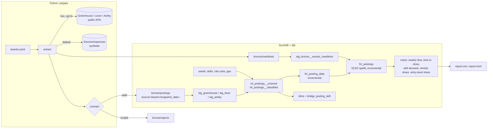

# jobpipe

An ELT pipeline that turns public Greenhouse, Lever and Ashby job-board postings into a DuckDB/dbt analytics warehouse and static reports.

A Python extractor lands raw JSON in a
date-partitioned bronze lake; **dbt + DuckDB** normalise the three providers into one
schema, track each posting's lifecycle SCD2-style (first seen / last seen / closed), and
build marts for weekly openings and closings, time-to-close, skill demand, remote share
and entry-level share. A single `pipeline run` command does extract, `dbt build` and a
static HTML/Markdown report, and re-running it gives the same result. Everything runs
offline against committed **synthetic** fixtures by default; real boards are only fetched
with an explicit `--live` flag. A Terraform module for a GCP version (GCS + BigQuery + service account) is included,
validated with `terraform validate` and **never applied**.

## Features

- **Polite extractor**: per-host rate limiting, retries with capped exponential backoff and
  jitter (`Retry-After` sets a floor on the delay), conditional requests (`If-None-Match` /
  `If-Modified-Since`) with an on-disk validator cache, and a descriptive User-Agent.
- **Schema contract on extract** (pydantic): bad records are quarantined to
  `bronze/rejects/` with their field errors. A response that is mostly invalid, or whose
  posting count collapses against the previous snapshot (an empty or truncated 200), fails
  the board instead of silently "closing" its postings. A posting that is still listed but
  fails the contract counts as observed, so it does not close and reopen. The drop guard
  can be tightened per board, waived for one run (`--accept-drop`), and a bad day that
  slipped through can be withdrawn with `pipeline invalidate`.
- **Bronze lake**: raw payloads kept verbatim as Hive-partitioned JSONL
  (`source=/board=/snapshot_date=`), plus a manifest per board snapshot with a content
  hash of what was landed. Re-landing a day replaces its files instead of duplicating
  rows. Each file is replaced atomically and the manifest is written last; a crash in
  between leaves a torn partition, which a reconciliation test detects and a re-run
  repairs.
- **dbt project** (`transform/`): staging per provider, then intermediate and core models,
  then marts. There are two incremental models: a snapshot fact that overwrites only
  changed board-day partitions, and a lifecycle fact that recomputes a board only when a
  watermark of its successful snapshots changes. "Changed" means a new `landing_id`
  (extraction time + content hash), so a re-landed day whose content changed under the
  same timestamp is reprocessed too. That second design also handles
  out-of-order backfills. Pre-hooks delete stale rows first, so a day re-landed with zero
  postings is handled too (plain `delete+insert` misses it).
- **Data quality**: 103 dbt data tests: `unique`, `not_null`, `relationships` and
  `accepted_values`, plus custom generic tests (`not_before`, `between`,
  `unique_combination_of_columns`) and 8 singular tests. The singular tests cover no
  overlapping spells, closures only on successful snapshots, open spells on the latest
  snapshot, bronze reconciling with the manifests, the incremental fact matching a
  rebuild from bronze row by row (which also catches a rule change made without
  `--full-refresh`), and executable examples for the skill patterns, the title
  classifier and location parsing.
- **Failure semantics**: a failed fetch (HTTP 500, timeout, redirect loop, contract
  failure) is recorded but can never close a posting; one board's error never stops the
  others; a later failure never overwrites a good snapshot for the same day.
- **Fixture and live data stay apart**: `--live` writes to `data/live` by default, the
  extractor refuses to land a second fetch mode into the same lake unless you pass
  `--allow-mixed`, and the report's "synthetic" banner appears only when every snapshot is
  a fixture (mixed data gets a warning).
- **Report**: Markdown + HTML (light/dark), byte-for-byte reproducible from the same
  bronze data. See [docs/sample_report.md](docs/sample_report.md) (synthetic data).
- **Cloud option**: `infra/gcp` Terraform (GCS bronze bucket with versioning and lifecycle
  rules, a BigQuery raw dataset with partitioned/clustered `bronze_postings` and
  `bronze_manifests` tables, one dataset per dbt layer, a least-privilege service account
  with no keys) and a documented `bigquery` dbt target. Never applied, and the BigQuery
  target has known gaps (see Limitations).
- **Docker image** and **GitHub Actions CI** (ruff, pytest, dbt build on fixtures +
  idempotency diff, terraform validate, docker build + offline container run). CI only:
  nothing is deployed.

## Quick start

Requires Python 3.11 and [uv](https://docs.astral.sh/uv/).

```bash
uv sync --frozen --extra dev        # project-local .venv from uv.lock
uv run pipeline run                 # fixtures -> data/bronze -> data/warehouse.duckdb -> data/reports/
open data/reports/report.html       # or read data/reports/report.md

# Run individual pipeline stages
uv run pipeline extract --date 2026-08-03   # land one fixture snapshot
uv run pipeline transform                   # dbt build (incremental)
uv run pipeline transform --full-refresh    # rebuild incremental models from bronze
uv run pipeline report

# operator tools: withdraw a landed day that turned out partial; accept one genuine drop
uv run pipeline invalidate --board greenhouse:mapleledger --date 2026-09-07 --reason "partial list"
uv run pipeline run --live --accept-drop greenhouse:airbnb

# Query the time-to-close mart
uv run python -c "import duckdb; print(duckdb.connect('data/warehouse.duckdb').sql('select * from analytics.mart_time_to_close'))"
```

**Live mode (opt-in, network):** `uv run pipeline run --live` reads the public boards
listed in `config/boards.live.example.yaml` (or `--config your.yaml`) into `data/live`
(build or report it later with `--data-dir data/live`).
These are free, unauthenticated, read-only endpoints; keep the list short. Live data
stays in your local `data/` directory (git-ignored) and is never committed.

**Docker:** `docker build -t jobpipe . && docker run --rm -v "$PWD/data:/data" jobpipe run`

**Make:** `make install lint test run tf-validate docker`

## Architecture



```
pipeline run  =  extract (bronze)  ->  dbt build (seeds, models, 103 tests)  ->  report
```

Design choices and trade-offs are documented in [DESIGN.md](DESIGN.md).

## Testing

```bash
uv run pytest -q                    # 107 tests: 90 unit + 17 integration (dbt on fixtures)
uv run pytest -q -m "not integration"   # fast unit tests only (~1 s)
uv run ruff check . && uv run ruff format --check .
cd infra/gcp && terraform init -backend=false && terraform validate
```

The unit tests mock all HTTP with `httpx.MockTransport`, and an autouse fixture makes
any real network call fail the test. The integration tests run the real dbt project and
check several things:

- the scripted fixture scenarios: a closed posting, a reopened posting, a retitled
  posting, an HTTP 500 that must not close anything, a quarantined record, a posting that
  is listed but fails the contract for one snapshot (it must keep one spell), an unlisted
  job, and a duplicated job;
- the lifecycle table against an **independent Python oracle** computed straight from the
  bronze files;
- re-runs are idempotent;
- landing snapshots one run at a time, **out of order** (a backfilled day), gives exactly
  the same tables as one full build;
- re-landing a day as an empty board, editing an already-landed fixture under the same
  timestamp, and invalidating a day all give the same tables incrementally as with
  `--full-refresh`;
- a classification rule change made without `--full-refresh` fails the reconciliation
  test instead of passing silently.

## Results

Measured on a shared 4-vCPU Linux container, 2026-10-03. Details
in [VERIFICATION.md](VERIFICATION.md).

| What | Measured |
|---|---|
| pytest | 107 passed (90 unit, 17 integration) in 229.4 s |
| dbt build on fixtures | 129 nodes OK: 7 seeds, 8 views, 9 tables, 2 incremental, 103 data tests (95 generic, 8 singular) |
| Fixture dataset | 5 synthetic boards x 6 weekly snapshots: 30 board snapshots (29 ok, 1 injected HTTP 500), 372 posting lines, 2 contract rejects (one of them a still-listed posting), 115 distinct postings, 116 lifecycle spells |
| `pipeline run` wall time (fixtures) | fresh 23.2-27.2 s, repeat run 16.0-19.0 s (3 runs each). Most of the gap is dbt's partial-parse cache (`pipeline transform` 12.6-12.9 s with it, 15.8-21.9 s without), not incremental processing (see Limitations) |
| Live extraction (once, 2026-10-03, earlier code version) | 4 public boards (2 Greenhouse, 1 Lever, 1 Ashby): 4/4 ok on the first attempt, 1,344 postings, 0 contract rejects, all 4 returned an `ETag`; dbt build passed on the live data |
| Pattern calibration on that live data | tightening two regexes cut "Go" matches from 275 to 164 postings and "Accessibility" from 381 to 5 (boilerplate "accessible to everyone") |
| Docker | image builds in 103 s without cache; 1.34 GB on disk (349 MB content size per `docker images`); `docker run --network none ... run` completes the fixture pipeline in 32.7-39.6 s (2 runs), report byte-identical to the local one |
| Terraform | `fmt -check`, `init -backend=false`, `validate` pass (Terraform 1.9.8 and 1.16.5, google provider 6.50.0) |

The live figures are a point-in-time snapshot of those boards on 2026-10-03. They will
differ on any rerun, and the live data itself was not kept or committed, so they cannot be
re-checked from this repository. The current extraction and model changes are tested
on fixtures and mocked HTTP only; the live run was not repeated. Adding geo aliases
cut unknown-country postings from 787 to 118 in that sample, but the current location
parser differs, so that figure does not describe the current code.

## Limitations

- **Snapshot resolution**: lifecycle dates are only as precise as the extraction cadence.
  `days_to_close` is measured `first_seen -> closed_at`, an upper bound with weekly
  snapshots. Spells already open at the first snapshot are left-censored and excluded from
  time-to-close; still-open spells are right-censored, so medians understate long-lived
  postings. A survival model (Kaplan-Meier) could account for right-censoring.
- **Keyword extraction is regex over text**: it is calibrated against executable examples
  and one live sample, but it still has false positives and false negatives ("go" is
  ambiguous; skills phrased unusually are missed). It counts mentions, not requirements.
- **Role family / seniority** come from title regexes, checked against
  `title_classification_cases.csv`; about 10% of the live sample stayed `other`.
- **Role and seniority rule changes need `--full-refresh`**: those values are stored in
  the incremental `fct_posting_daily`, which does not reprocess old partitions when a seed
  or macro changes. It is not silent: `assert_daily_fact_reconciles_with_bronze` fails
  and the CLI prints a `--full-refresh` hint. Skill vocabulary changes need nothing:
  `bridge_posting_skill` and the skill mart are rebuilt on every run.
- **Location parsing is alias matching**: two-letter codes that are both a state/province
  and a country code are resolved with the city when one is known ("Toronto, CA" is
  Canada); with no known city, "CA" and "IN" read as California and Indiana.
  `transform/seeds/geo_location_cases.csv` lists the behaviour, ambiguities included.
- **Incremental saves writes, not scans**: staging views read the whole bronze lake on
  every run (no `snapshot_date` filter is pushed down). At this size a repeat run is
  faster mainly because dbt reuses its parse cache, not because less SQL runs.
- **Listed-but-rejected postings** keep their lifecycle spell, but they are not in
  `fct_posting_daily`, so weekly "listed" counts and shares leave them out for that day.
- **BigQuery target is documented, not run**: the dataset naming, datasets, IAM and
  `bronze_manifests` table line up with the Terraform, but staging still reads the local
  lake with DuckDB's `read_json`, and a fair amount of SQL is DuckDB-only (`FILTER`
  aggregates in most marts, `arg_max`/`arg_min`, `median`/`quantile_cont`, list
  functions, `epoch_ms`, `union all by name` and more; the known gaps are in
  [DESIGN.md, decision 9](DESIGN.md#9-cloud-option-validated-not-applied)).
  The Terraform has never been applied.
- **Single-machine scale**: DuckDB + one process. That is fine for thousands of boards'
  postings, but it is not a distributed system.
- Provider APIs and board tokens change; a board that 404s is recorded as a failed
  snapshot. Respect each provider's terms and keep live runs small.

## License

MIT, see [LICENSE](LICENSE). All fixture companies and postings are synthetic.
